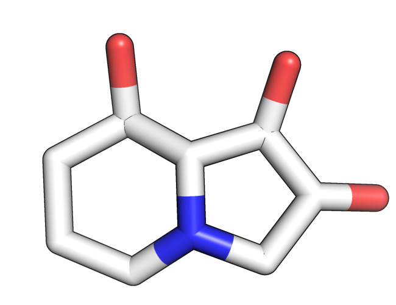
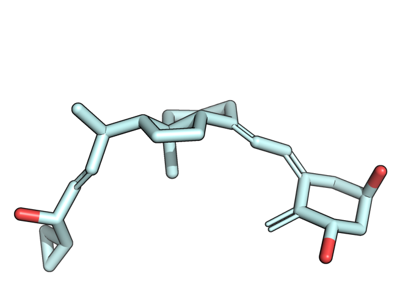
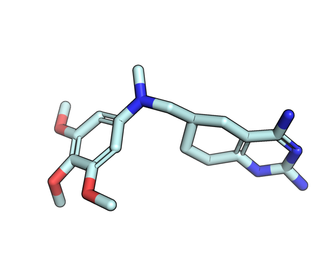
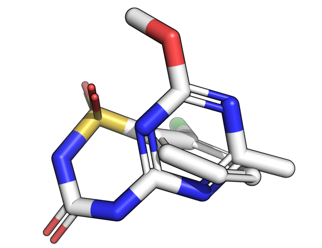
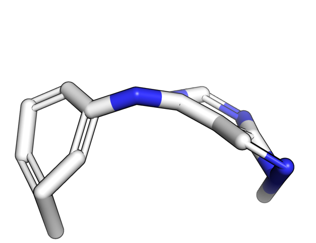
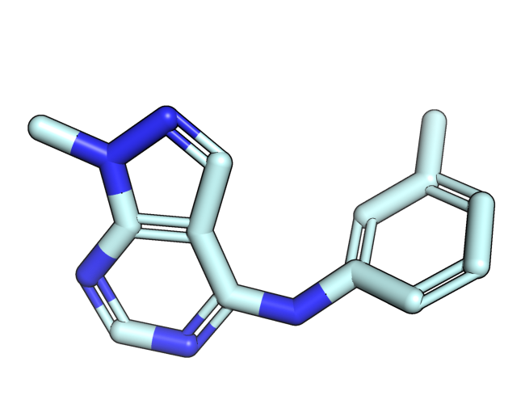
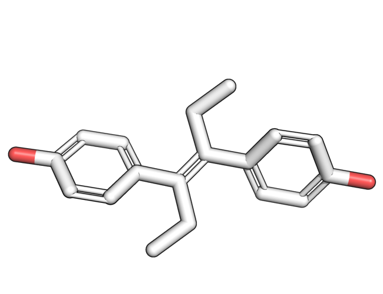
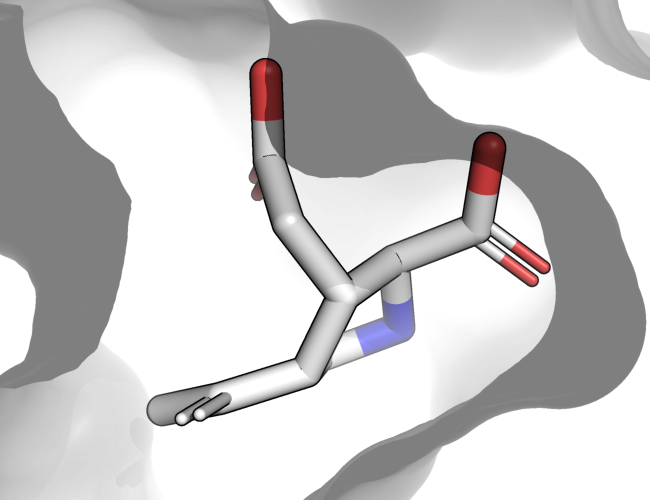
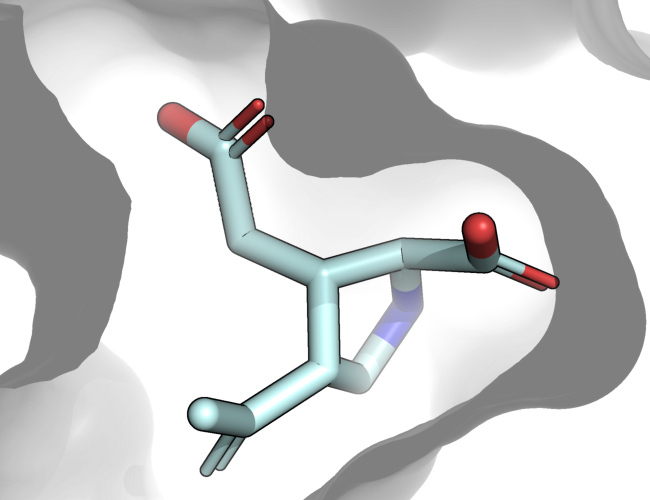

.. _checks:

Checks
====================================

Example failure modes
~~~~~~~~~~~~~~~~~~~~~~~~~~~~~~~~~~~~~

.. |tetrahedral_stereo_true| image:: images/crystal_astex_1hww.png
   :height: 500 px
   :width: 650 px
   :scale: 40 %
   :alt: Tetrahedral stereochemistry true

.. |double_bond_stereo_fail| image:: images/diffdock_astex_1s19.png
   :height: 500 px
   :width: 650 px
   :scale: 40 %
   :alt: Double bond stereochemistry fail

.. |bond_lengths_fail| image:: images/unimol_astex_1k3u.png
   :height: 500 px
   :width: 650 px
   :scale: 40 %
   :alt: Bond lengths fail

.. |bond_lengths_true| image:: images/crystal_astex_1k3u.png
   :height: 500 px
   :width: 650 px
   :scale: 40 %
   :alt: Bond lengths true

.. |bond_angles_fail| image:: images/tankbind_astex_1s3v.png
   :height: 500 px
   :width: 650 px
   :scale: 40 %
   :alt: Bond angles fail

.. |internal_clash_true| image:: images/crystal_astex_1t9b.png
   :height: 500 px
   :width: 650 px
   :scale: 40 %
   :alt: Internal clash true

.. |energy_ratio_true| image:: images/crystal_astex_1tz8.png
   :height: 500 px
   :width: 650 px
   :scale: 40 %
   :alt: Energy ratio true

In molecular conformation generation, docking, and de-novo molecular generation the generated molecules
conformation should have a reasonable geometry including standard bond lengths and angles and
no steric clash.

+---------------------------------------------+----------------------------------------+
| Bond lengths                                                                         |
+---------------------------------------------+----------------------------------------+
| |bond_lengths_fail|                         | |bond_lengths_true|                    |
|                                             |                                        |
| Bottom left carbon-oxygen bond too short    |                                        |
+---------------------------------------------+----------------------------------------+

+---------------------------------------------+----------------------------------------+
| Bond angles                                                                          |
+---------------------------------------------+----------------------------------------+
| |bond_angles_fail|                          | |bond_angles_true|                     |
|                                             |                                        |
| Bond angles off and atoms clashing          |                                        |
+---------------------------------------------+----------------------------------------+

+---------------------------------------------+----------------------------------------+
| Steric clash                                                                         |
+---------------------------------------------+----------------------------------------+
| |internal_clash_fail|                       | |internal_clash_true|                  |
|                                             |                                        |
| Molecule intertwined and atoms clashing     |                                        |
+---------------------------------------------+----------------------------------------+

+---------------------------------------------+----------------------------------------+
| High energy conformation                                                             |
+---------------------------------------------+----------------------------------------+
| |energy_ratio_fail|                         | |energy_ratio_true|                    |
|                                             |                                        |
| Twisted rings energetically unfavorable     |                                        |
+---------------------------------------------+----------------------------------------+

+---------------------------------------------+----------------------------------------+
| Aromatic rings not flat                                                              |
+---------------------------------------------+----------------------------------------+
| |flat_aromatics_fail|                       | |flat_aromatics_true|                  |
|                                             |                                        |
| Conjugated pi bond systems should be flat   |                                        |
+---------------------------------------------+----------------------------------------+

In docking the molecular identity should be preserved including stereochemistry.

+---------------------------------------------+----------------------------------------+
| Tetrahedral stereochemistry changed                                                  |
+---------------------------------------------+----------------------------------------+
| |tetrahedral_stereo_fail|                   | |tetrahedral_stereo_true|              |
|                                             |                                        |
| Top right oxygen facing the wrong way       |                                        |
+---------------------------------------------+----------------------------------------+

+---------------------------------------------+----------------------------------------+
| Double bond stereochemistry changed                                                  |
+---------------------------------------------+----------------------------------------+
| |double_bond_stereo_fail|                   | |double_bond_stereo_true|              |
|                                             |                                        |
| Right most double bond should be cis        |                                        |
+---------------------------------------------+----------------------------------------+

In de-novo molecular generator or docking the generated molecule should be placed
with in a receptor's binding pocket without any steric clash.

+---------------------------------------------+----------------------------------------+
| Volume overlap                              |                                        |
+---------------------------------------------+----------------------------------------+
| |volume_overlap_fail|                       | |volume_overlap_true|                  |
|                                             |                                        |
| Ligand and receptor clash                   |                                        |
+---------------------------------------------+----------------------------------------+

.. _sanitisation: https://www.rdkit.org/docs/RDKit_Book.html#molecular-sanitization

In addition to these geometric considerations, molecules should always pass RDKit's chemical `sanitisation`_ checks, as well as be interconvertible with InChI strings.

More details on tests and docking method comparison
~~~~~~~~~~~~~~~~~~~~~~~~~~~~~~~~~~~~~~~~~~~~~~~~~~~~~~

.. _preprint: https://arxiv.org/abs/2308.05777
.. _paper: https://doi.org/10.1039/D3SC04185A

For more detailed information about the tests and for a study using PoseBusters to compare docking methods, refer to our `preprint`_ or `paper`_:

.. code-block:: bibtex

   @article{buttenschoen2024posebusters,
      title = {{{PoseBusters}}: {{AI-based}} Docking Methods Fail to Generate Physically Valid Poses or Generalise to Novel Sequences},
      shorttitle = {{{PoseBusters}}},
      author = {Buttenschoen, Martin and Morris, Garrett M. and Deane, Charlotte M.},
      year = "2024",
      journal = "Chemical Science",
      volume = "15",
      issue = "9",
      pages = "3130-3139",
      publisher = "The Royal Society of Chemistry",
      doi = "10.1039/D3SC04185A",
      url = "http://dx.doi.org/10.1039/D3SC04185A",
   }
