============================================================================================================
PoseBusters: Plausibility checks for generated molecule poses.
============================================================================================================

PoseBusters is a command line tool and Python library to check the output of molecular conformation generators, docking programs, or other programs that generate molecules in 3D.

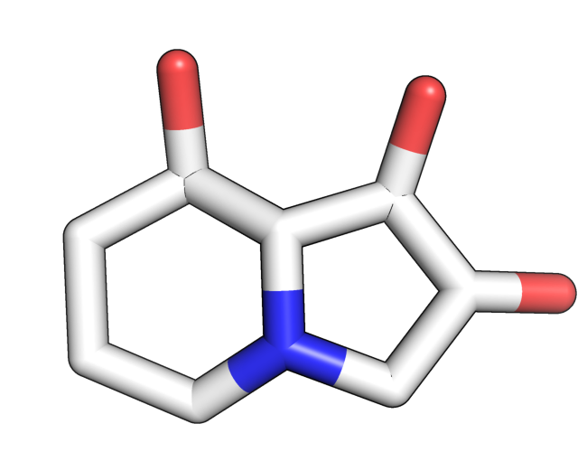

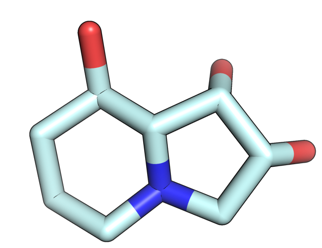

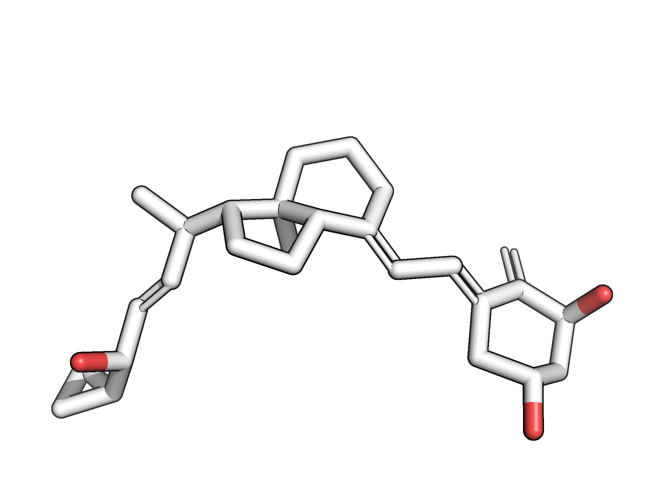

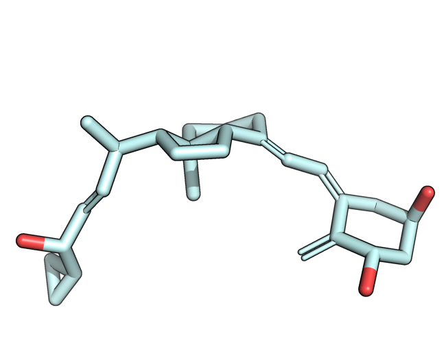

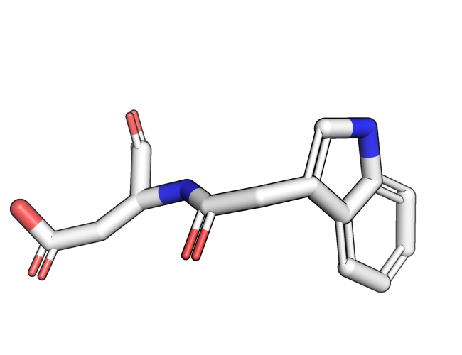

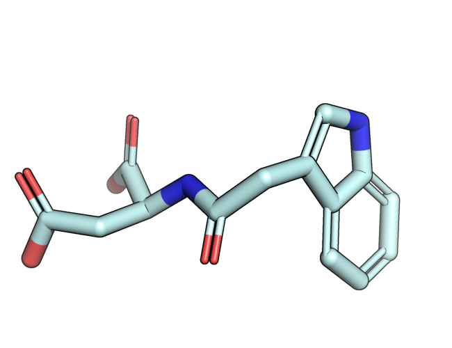

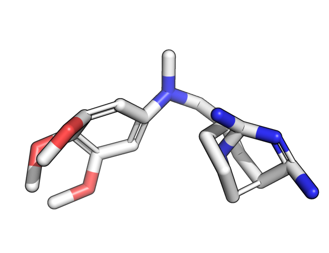

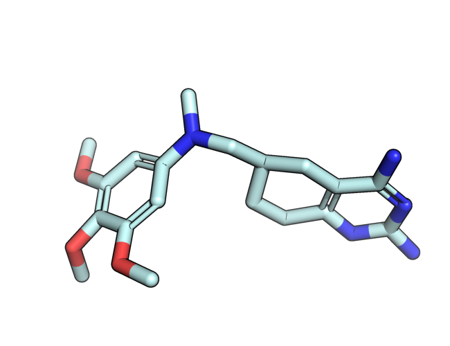

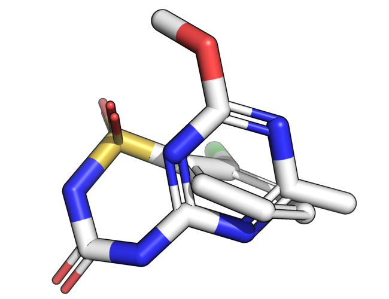

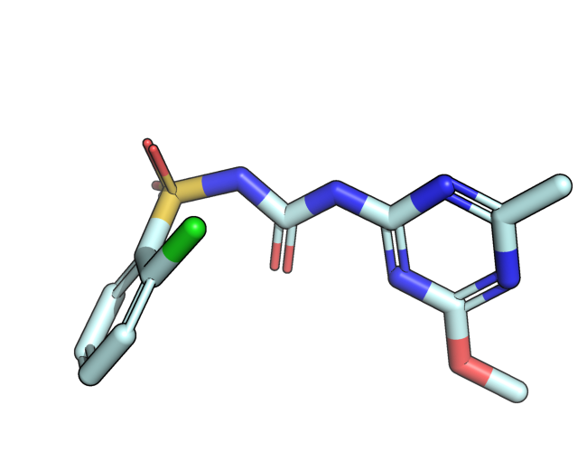

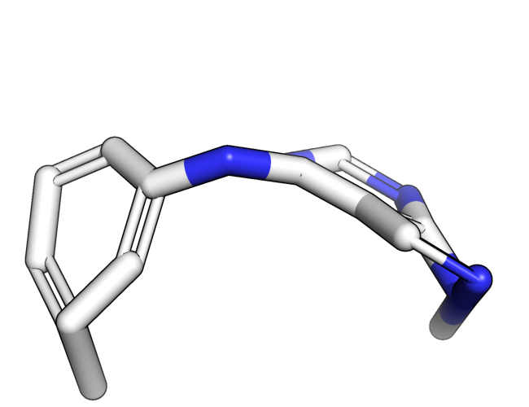

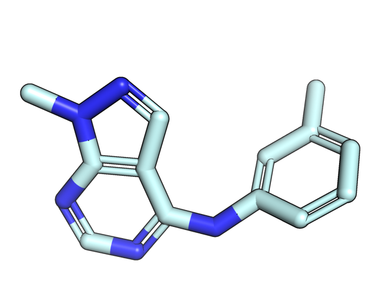

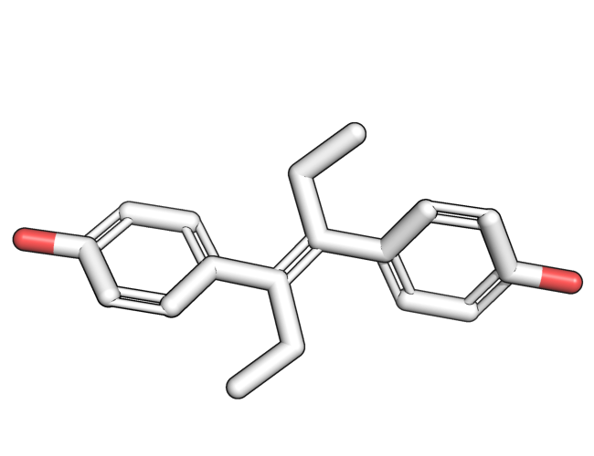

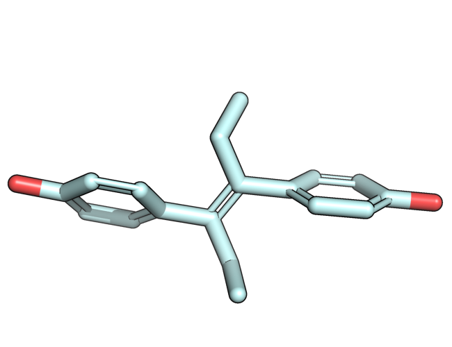

.. |volume_overlap_fail| image:: images/diffdock_astex_1tt1.png
   :height: 500 px
   :width: 650 px
   :scale: 40 %
   :alt: Volume overlap fail

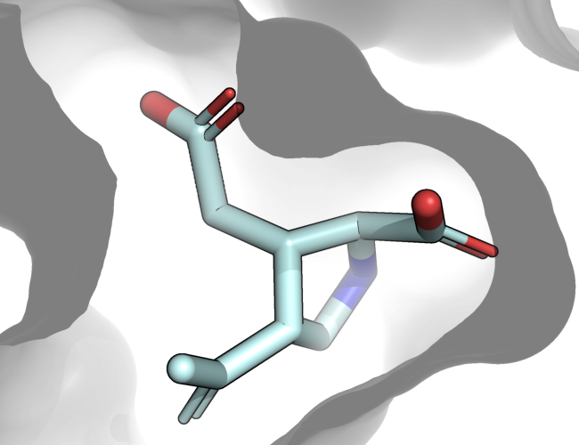

Quick start
====================================

PoseBusters can be installed from PyPI.

.. code-block:: bash

   >>> pip install posebusters

Use the ``bust`` command to check molecules, docked ligands or generated molecules conditioned on a protein.

.. command-output:: bust redocked_ligand.sdf -l crystal_ligand.sdf -p protein.pdb --outfmt short
  :cwd: inputs
  :ellipsis: 12

.. command-output:: bust redocked_ligand.sdf -l crystal_ligand.sdf -p protein.pdb --outfmt long
  :cwd: inputs
  :ellipsis: 12

.. command-output:: bust redocked_ligand.sdf -l crystal_ligand.sdf -p protein.pdb --outfmt csv
  :cwd: inputs
  :ellipsis: 12

For more usage examples, bulk processing, and the Python API see the documentation for the `command line tool  <cli.rst>`_
and the `Python library <python_library.ipynb>`_.

Docking methods comparison
====================================

.. _preprint: https://arxiv.org/abs/2308.05777
.. _paper: https://doi.org/10.1039/D3SC04185A

For more detailed information about the tests and for a study using PoseBusters to compare docking methods, refer to our `preprint`_ or `paper`_:

.. code-block:: bibtex

   @article{buttenschoen2024posebusters,
      title = {{{PoseBusters}}: {{AI-based}} Docking Methods Fail to Generate Physically Valid Poses or Generalise to Novel Sequences},
      shorttitle = {{{PoseBusters}}},
      author = {Buttenschoen, Martin and Morris, Garrett M. and Deane, Charlotte M.},
      year = "2024",
      journal = "Chemical Science",
      volume = "15",
      issue = "9",
      pages = "3130-3139",
      publisher = "The Royal Society of Chemistry",
      doi = "10.1039/D3SC04185A",
      url = "http://dx.doi.org/10.1039/D3SC04185A",
   }

Sample checks
====================================

For more examples and information on the checks, see :ref:`checks`.

+---------------------------------------------+----------------------------------------+
| Steric clash                                                                         |
+---------------------------------------------+----------------------------------------+
| Bad:                                        | Good:                                  |
|                                             |                                        |
| |internal_clash_fail|                       | |internal_clash_true|                  |
|                                             |                                        |
| Molecule intertwined and atoms clashing     |                                        |
+---------------------------------------------+----------------------------------------+

+---------------------------------------------+----------------------------------------+
| Aromatic rings flatness                                                              |
+---------------------------------------------+----------------------------------------+
| Bad:                                        | Good:                                  |
|                                             |                                        |
| |flat_aromatics_fail|                       | |flat_aromatics_true|                  |
|                                             |                                        |
| Conjugated pi bond systems should be flat   |                                        |
+---------------------------------------------+----------------------------------------+

+---------------------------------------------+----------------------------------------+
| Volume overlap                              |                                        |
+---------------------------------------------+----------------------------------------+
| Bad:                                        | Good:                                  |
|                                             |                                        |
| |volume_overlap_fail|                       | |volume_overlap_true|                  |
|                                             |                                        |
| Ligand and receptor clash                   |                                        |
+---------------------------------------------+----------------------------------------+

For more examples and information on the checks, see :ref:`checks`.

Contents
====================================

.. toctree::
   :maxdepth: 2

   Home <self>
   Checks <checks>
   Command line tool <cli>
   User API <api>
   User API examples <api_notebook>
